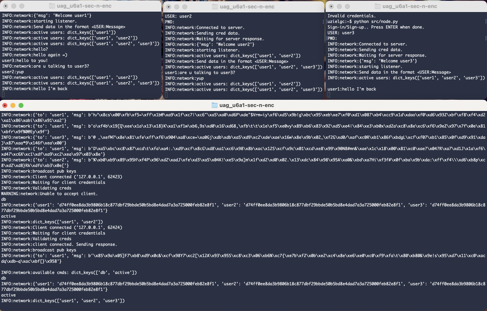
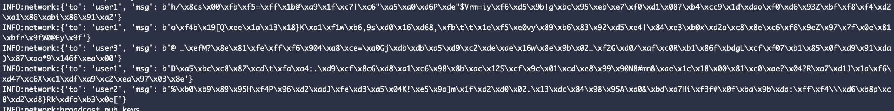
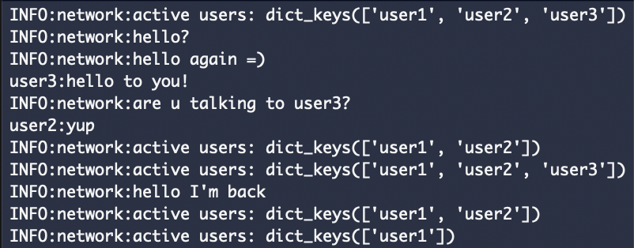

## U6 A1: Sec n Enc

### Author: Eloy Uziel García Cisneros (eloy.garcia@edu.uag.mx)
#### Repo: https://github.com/uzielgc/uag_u6a1-sec-n-enc

## Documentación

```
src/
  |-- network.py
  |__ node.py

```

### network.py

* Crypto: Crea llaves privada y pública RSA y proveé funciones de encriptado y desencriptado.
* User:  Es la representación de un usuario, almacena nombre de usuario y hashed pass.
* Network: Clase base para los sockets TCP.
* Server: Extiende el funcionamiento de la clase "Network" e implementa funciones propias del servidor; maneja los clientes y distribuye los mensajes.
* Client: Es responsable de establecer la conexión con el servidor e intercambia la llave publica con los demas nodos. Encripta y envia mensajes, recibe y decripta.

Al correr el nodo servidor se crea un thread para introducir comandos y monitorear los usuarios.

```
db: lista los usuarios registrados.
active: lista los usuarios conectados.
```

El código fuente se encuentra en la carpeta [src](src).

La evidencia en imagenes y/o video se encuentra en la carpeta [media](media).

El código esta comentado en los puntos clave del proceso.

### How to Run

Crear server:
```
python src/node.py -s
```

Inicializar cada uno de los clientes.
```
python src/node.py
```

*NOTA: instalar los requerimientos previo a ejecución:
```
pip install -r requirements.txt
```


[](media/enc.mov "Video Demo")

* Click en la imagen para ir al video demo. (media/enc.mov)^


[]
Mensajes encriptados 

[]
Mensajes decriptados 

### Output:

Terminal 1 server:
```
uzielgc:~$ python src/node.py -s
INFO:network:Starting server console.
INFO:network:Starting server, waiting for incomming conn.
INFO:network:Client connected ('127.0.0.1', 62414)
INFO:network:Waiting for client credentials
INFO:network:Validating creds
INFO:network:client connected. Sending response.
INFO:network:broadcast pub keys
INFO:network:Client connected ('127.0.0.1', 62416)
INFO:network:Waiting for client credentials
INFO:network:Validating creds
INFO:network:client connected. Sending response.
INFO:network:broadcast pub keys
INFO:network:Client connected ('127.0.0.1', 62417)
INFO:network:Waiting for client credentials
INFO:network:Validating creds
INFO:network:client connected. Sending response.
INFO:network:broadcast pub keys
INFO:network:{'to': 'user1', 'msg': b'h/\x8cs\x00\xfb\xf5=\xff\x1b@\xa9\x1f\xc7|\xc6"\xa5\xa0\xd6P\xde"$Vrm=iy\xf6\xd5\x9b!g\xbc\x95\xeb\xe7\xf0\xd1\x08?\xb4\xcc9\x1d\xdao\xf0\xd6\x93Z\xbf\xf8\xf4\xd2\xa1\x86\xabi\x86\x91\xa2'}
INFO:network:{'to': 'user1', 'msg': b'o\xf4b\x19[Q\xee\x1a\x13\x18}K\xa1\xf1w\xb6,9s\xd0\x16\xd68,\xfb\t\t\x1e\xf5\xe0vy\x89\xb6\x83\x92\xd5\xe4|\x84\xe3\xb0x\xd2a\xc8\x8e\xc6\xf6\x9eZ\x97\x7f\x0e\x81\xbfr\x9f%0@Ey\x9f'}
INFO:network:{'to': 'user3', 'msg': b'@ _\xefM?\x8e\x81\xfe\xff\xf6\x904\xa8\xce=\xa0Gj\xdb\xdb\xa5\xd9\xc2\xde\xae\x16w\x8e\x9b\x02_\xf2G\xd0/\xaf\xc0R\xb1\x86f\xbdgL\xcf\xf07\xb1\x85\x0f\xd9\x91\xda)\x87\xaa*9\x146f\xea\x00'}
INFO:network:{'to': 'user1', 'msg': b'D\xa5\xbc\xc8\x87\xcd\t\xfa\xa4:.\xd9\xcf\x8cG\xd8\xa1\xc6\x98\x8b\xac\x12S\xcf\x9c\x01\xcd\xe8\x99\x90N8#mn&\xae\x1c\x18\x00\x81\xc0\xae?\x04?R\xa7\xd1J\x1a\xf6\xd47\xc6X\xc1\xdf\xa9\xc2\xea\x97\x03\x8e'}
INFO:network:{'to': 'user2', 'msg': b'%\xb0\xb9\x89\x95H\xf4P\x96\xd2\xadJ\xfe\xd3\xa5\x04K!\xe5\x9a]m\x1f\xd2\xd0\x02.\x13\xdc\x84\x98\x95A\xa0&\xbd\xa7Hi\xf3f#\x0f\xba\x9b\xda:\xff\xf4\\\xd6\xb8p\xc8\xd2\xd8}Rk\xdfo\xb3\x0e['}
INFO:network:broadcast pub keys
INFO:network:Client connected ('127.0.0.1', 62423)
INFO:network:Waiting for client credentials
INFO:network:Validating creds
WARNING:network:Unable to accept client.
db
INFO:network:{'user1': 'd74ff0ee8da3b9806b18c877dbf29bbde50b5bd8e4dad7a3a725000feb82e8f1', 'user2': 'd74ff0ee8da3b9806b18c877dbf29bbde50b5bd8e4dad7a3a725000feb82e8f1', 'user3': 'd74ff0ee8da3b9806b18c877dbf29bbde50b5bd8e4dad7a3a725000feb82e8f1'}
active
INFO:network:dict_keys(['user1', 'user2'])
INFO:network:Client connected ('127.0.0.1', 62424)
INFO:network:Waiting for client credentials
INFO:network:Validating creds
INFO:network:client connected. Sending response.
INFO:network:broadcast pub keys
INFO:network:{'to': 'user1', 'msg': b'\x85\x9a\x05]F7\xb8\xd9\x0c&\xcf\x98Y7\xc2[\x12A\x93\x95S\xc8\xc3\x06\xb6%\xc7{\xe7b\xf2\x0b\xe2\xc4\x8e\xe6\xe0\xc0\xf9\xfa\t\x80\xb80&\x9e!s\x95\xd7\x11\xc0\xacdq\xdb~q\xac\xbf[}\x958'}

INFO:network:available cmds: dict_keys(['db', 'active'])
db
INFO:network:{'user1': 'd74ff0ee8da3b9806b18c877dbf29bbde50b5bd8e4dad7a3a725000feb82e8f1', 'user2': 'd74ff0ee8da3b9806b18c877dbf29bbde50b5bd8e4dad7a3a725000feb82e8f1', 'user3': 'd74ff0ee8da3b9806b18c877dbf29bbde50b5bd8e4dad7a3a725000feb82e8f1'}
active
INFO:network:dict_keys(['user1', 'user2', 'user3'])
```

Terminal - client:
```
uzielgc:~$ python src/node.py
Sign-in/Sign-up.. Press ENTER when done.
USER: user1
PWD: 
INFO:network:Connected to server.
INFO:network:Sending cred data.
INFO:network:Waiting for server response.
INFO:network:{'msg': 'Welcome user1'}
INFO:network:starting listener.
INFO:network:Send data in the format <USER:Message>
INFO:network:active users: dict_keys(['user1'])
INFO:network:active users: dict_keys(['user1', 'user2'])
INFO:network:active users: dict_keys(['user1', 'user2', 'user3'])
INFO:network:hello?
INFO:network:hello again =)
user3:hello to you!
INFO:network:are u talking to user3?
user2:yup
INFO:network:active users: dict_keys(['user1', 'user2'])
INFO:network:active users: dict_keys(['user1', 'user2', 'user3'])
INFO:network:hello I'm back
```

Terminal - client2:
```
uzielgc:~$ python src/node.py
Sign-in/Sign-up.. Press ENTER when done.
USER: user2
PWD: 
INFO:network:Connected to server.
INFO:network:Sending cred data.
INFO:network:Waiting for server response.
INFO:network:{'msg': 'Welcome user2'}
INFO:network:starting listener.
INFO:network:active users: dict_keys(['user1', 'user2'])
INFO:network:Send data in the format <USER:Message>
INFO:network:active users: dict_keys(['user1', 'user2', 'user3'])
user1:are u talking to user3?
INFO:network:yup
INFO:network:active users: dict_keys(['user1', 'user2'])
INFO:network:active users: dict_keys(['user1', 'user2', 'user3'])
```

Terminal - client3:
```
Sign-in/Sign-up.. Press ENTER when done.
USER: user3
PWD: 
INFO:network:Connected to server.
INFO:network:Sending cred data.
INFO:network:Waiting for server response.
Invalid credentials.
uzielgc:~$ python src/node.py
Sign-in/Sign-up.. Press ENTER when done.
USER: user3
PWD: 
INFO:network:Connected to server.
INFO:network:Sending cred data.
INFO:network:Waiting for server response.
INFO:network:{'msg': 'Welcome user3'}
INFO:network:starting listener.
INFO:network:Send data in the format <USER:Message>
INFO:network:active users: dict_keys(['user1', 'user2', 'user3'])

user1:hello I'm back
```